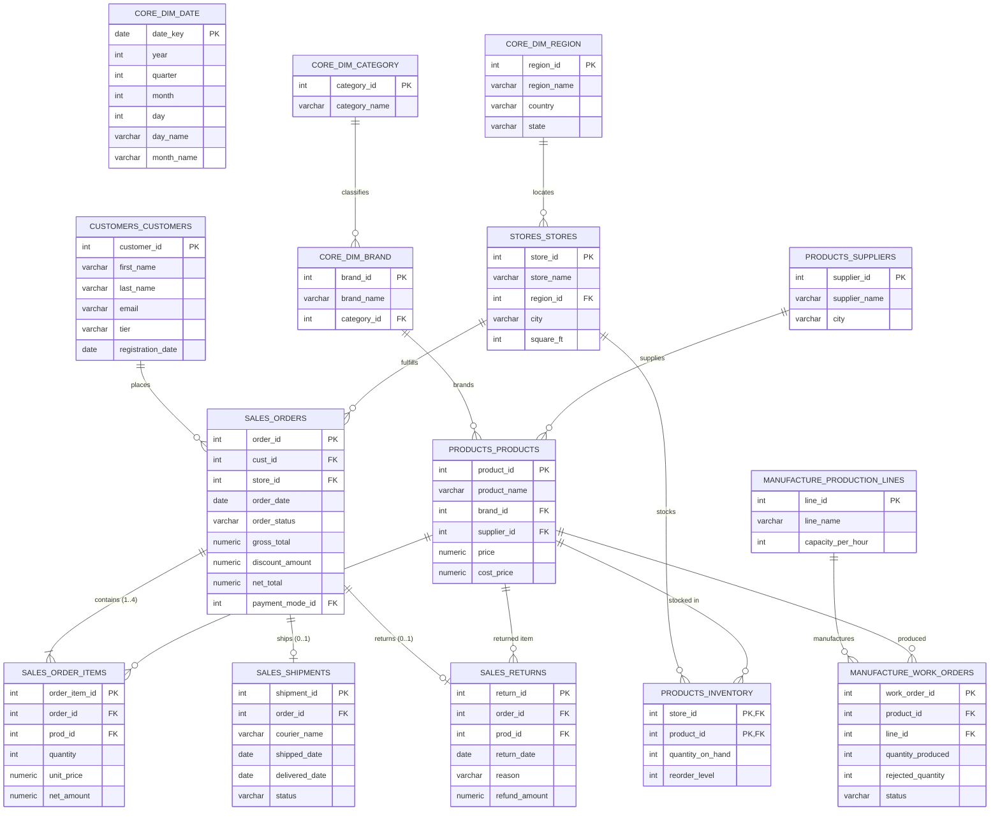

# RetailMart V3 - Relational Data Model & Architecture Diagram

```mermaid
erDiagram
    CORE_DIM_DATE {
        date date_key PK
        int year
        int quarter
        int month
        int day
        varchar day_name
        varchar month_name
    }

    CORE_DIM_REGION {
        int region_id PK
        varchar region_name
        varchar country
        varchar state
    }

    CORE_DIM_CATEGORY {
        int category_id PK
        varchar category_name
    }

    CORE_DIM_BRAND {
        int brand_id PK
        varchar brand_name
        int category_id FK
    }

    PRODUCTS_SUPPLIERS {
        int supplier_id PK
        varchar supplier_name
        varchar city
    }

    PRODUCTS_PRODUCTS {
        int product_id PK
        varchar product_name
        int brand_id FK
        int supplier_id FK
        numeric price
        numeric cost_price
    }

    STORES_STORES {
        int store_id PK
        varchar store_name
        int region_id FK
        varchar city
        int square_ft
    }

    CUSTOMERS_CUSTOMERS {
        int customer_id PK
        varchar first_name
        varchar last_name
        varchar email
        varchar tier
        date registration_date
    }

    SALES_ORDERS {
        int order_id PK
        int cust_id FK
        int store_id FK
        date order_date
        varchar order_status
        numeric gross_total
        numeric discount_amount
        numeric net_total
        int payment_mode_id FK
    }

    SALES_ORDER_ITEMS {
        int order_item_id PK
        int order_id FK
        int prod_id FK
        int quantity
        numeric unit_price
        numeric net_amount
    }

    SALES_SHIPMENTS {
        int shipment_id PK
        int order_id FK
        varchar courier_name
        date shipped_date
        date delivered_date
        varchar status
    }

    SALES_RETURNS {
        int return_id PK
        int order_id FK
        int prod_id FK
        date return_date
        varchar reason
        numeric refund_amount
    }

    PRODUCTS_INVENTORY {
        int store_id PK,FK
        int product_id PK,FK
        int quantity_on_hand
        int reorder_level
    }

    MANUFACTURE_PRODUCTION_LINES {
        int line_id PK
        varchar line_name
        int capacity_per_hour
    }

    MANUFACTURE_WORK_ORDERS {
        int work_order_id PK
        int product_id FK
        int line_id FK
        int quantity_produced
        int rejected_quantity
        varchar status
    }

    %% Relationships
    CORE_DIM_CATEGORY ||--o{ CORE_DIM_BRAND : "classifies"
    CORE_DIM_BRAND ||--o{ PRODUCTS_PRODUCTS : "brands"
    PRODUCTS_SUPPLIERS ||--o{ PRODUCTS_PRODUCTS : "supplies"
    CORE_DIM_REGION ||--o{ STORES_STORES : "locates"
    CUSTOMERS_CUSTOMERS ||--o{ SALES_ORDERS : "places"
    STORES_STORES ||--o{ SALES_ORDERS : "fulfills"
    SALES_ORDERS ||--|{ SALES_ORDER_ITEMS : "contains (1..4)"
    PRODUCTS_PRODUCTS ||--o{ SALES_ORDER_ITEMS : "includes"
    SALES_ORDERS ||--o| SALES_SHIPMENTS : "ships (0..1)"
    SALES_ORDERS ||--o| SALES_RETURNS : "returns (0..1)"
    PRODUCTS_PRODUCTS ||--o{ SALES_RETURNS : "returned item"
    STORES_STORES ||--o{ PRODUCTS_INVENTORY : "stocks"
    PRODUCTS_PRODUCTS ||--o{ PRODUCTS_INVENTORY : "stocked in"
    MANUFACTURE_PRODUCTION_LINES ||--o{ MANUFACTURE_WORK_ORDERS : "manufactures"
    PRODUCTS_PRODUCTS ||--o{ MANUFACTURE_WORK_ORDERS : "produced"
```
